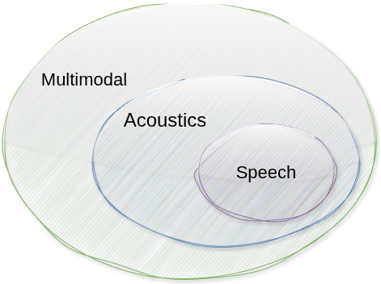

> Do! Don’t just read.

BTA is a speech AI researcher and educator at NAIST. He does research, teaching, and supervising in speech processing — from speech classification to ASR and TTS —, to acoustics and multimodal information fusion. Diagram below shows the connection between multimodal, acoustics, and speech, in which each concept is part of larger concept. Multimodal fusion combines information from multiple modalities, such as audio, visual, and text. Acoustics focuses on the physical properties of sound and how it is produced, transmitted, and perceived, including music, speech, and noise. Speech processing involves analyzing and understanding human speech signals for various applications.

 

Below is a mindmap of BTA's research, tools, tutorials, courses, publications, and other interests. Click on the nodes to explore more.  

<pre class="mermaid">
mindmap
  root((BTA))
    Tools
      Nkululeko
      Speechain
      PaperRAG
      Audiokit
      Sherox
    Publications
      Speech Communication
      ICASSP
      Interspeech
      O-COCOSDA
      APSIPA
    Tutorials
      Shell and Linux
      Python Tutorial
      Shell extras
    Courses
      Speech Recognition Course
      Python for Signal Processing
      Multimodal Processing
      Basic Mathematics
    Japanese
      Ayo Belajar Bahasa Jepang
      Minna no Nihongo
      Japanese for Work
      Kanji Drills
      Kotoba  
      JLPT  
      JED
      Wani Kanji
    Islam
      Kisah Nabi
      Arbain Nawawi
</pre>

