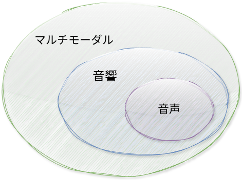

> 実践せよ。読むだけで終わらない。

BTA は NAIST の音声 AI 研究者・教育者です。音声分類から ASR、TTS までの音声処理から、音響学やマルチモーダル情報融合に関する研究、教育、学生指導を行っています。下図は、マルチモーダル、音響、音声の関係を示しており、それぞれの概念がより大きな概念に含まれることを表しています。マルチモーダルは、音声、映像、テキストなど複数のモダリティからの情報を統合します。音響学は、音楽・音声・ノイズを含め、音がどのように生成・伝達・知覚されるかという物理的性質を扱います。音声処理は、さまざまな用途のために人間の音声信号を分析し理解することです。

日本語については、日本語能力試験（JLPT）N3を取得（2020年）。来日後も学習を継続しており、下記マインドマップの「日本語」に挙げた教材・ツールは自身の学習のために作成したものです。

 

以下は、BTA の研究、ツール、チュートリアル、コース、論文、その他の関心事をまとめたマインドマップです。ノードをクリックすると詳細を確認できます。
<pre class="mermaid">
mindmap
  root((BTA))
    ツール
      Nkululeko
      Speechain
      PaperRAG
      Audiokit
      Sherox
    チュートリアル
      ShellとLinux
      Pythonチュートリアル
      Shell拡張
    コース
      音声認識コース
      信号処理のためのPython
      マルチモーダル処理
      基礎数学
    論文
      Speech Communication
      ICASSP
      Interspeech
      O-COCOSDA
      APSIPA
    日本語
      Ayo Belajar Bahasa Jepang
      みんなの日本語
      仕事のための日本語
      漢字ドリル
      ことば
      JLPT
      JED
      Wani Kanji
    イスラム
      預言者物語
      アルバイン・ナワウィ
</pre>

