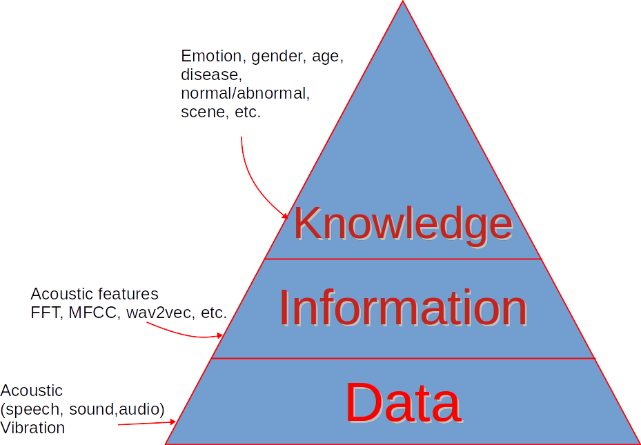
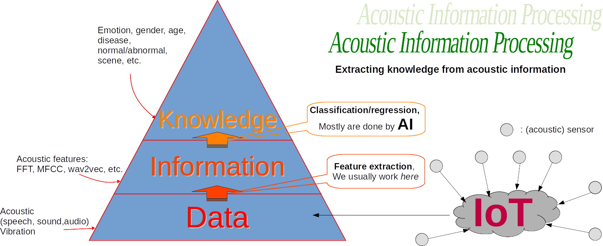
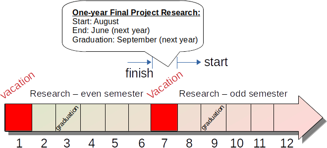

## Research Theme

My research goals aimed at extracting knowledge from acoustic information (aka acoustic features). The examples of this theme are: speech emotion recognition, abnormal sound detection, and audio classication. Moreover, the research can be extended to vibration signal. My approaches to achieve these goal are defined by: (1) data-driven approach (instead of physical modeling), (2) focus on practical implemention (not necessary to follow human  mechanism), and robustness (how stable/consistent the model given any perturbation instead of correctness). For me, science should be evidence-based, able to be implemented and consistent. My research is result-oriented instead of process-oriented. It doesn't mean that process (physical phenomena, modeling, math, and algorithms) is not important. If we understand the process very well, the solution may appears by itself. Still, there is must be a reason (rationale) for doing such reaserch. Then, I judge my research mainly based on the results. My research contributes to developing technologies to solve issues in Society 5.0 (What is Society 5.0? [Read here in Indonesian language](http://bagustris.blogspot.com/2022/04/menuju-masyarakat-50-melalui-riset-dan.html)).

<!--- --->

The following is research theme that I offered, particularly (but NOT limited) for Enginenering Physics students ITS.  
<!--- *Berikut ini adalah tema riset, khususnya judul-judul TA yang saya tawarkan kepada mahasiswa Departemen Teknik Fisika ITS.*    --->

For undergraduate level, I will try to provide the baseline method, and you will improve the results using your proposed method.
 
1. Speech emotion recognition using multilayer perceptron with CCC loss, dataset: IEMOCAP
2. Indonesian speech recognition using Wav2Vec2/Hubert/WavLM/UniSpeech-SAT, etc.
3. Toward universal acoustic features for multi-corpus speech emotion recognition, 30+ datasets.  
~~4. Predicting Alzheimer desease using speech analysis.~~
5. Development of Calfem-Python
6. Development of Vibration Toolbox  
~~7. Abnormal sound detection for predictive maitenance (the method is from you/your idea), dataset: DCASE~~
8. Indonesian emotional Speech synthesis Using FastSpeech  
~~9. COVID-19 diagnosis using COUGH sound with deep learning~~
10. COVID-19 diagnosis using SPEECH sound with deep learning, dataset: ComParE CSS 2021
11. Predicting pathological voice disorder with speech processing technique, dataset: SVD, Voiced, HUPA
12. Detecting of emotion intensity of non-speech sound (laughter, crying, etc.)
13. Detecting/predicting stuttering (bahasa: gagap) in speech with machine learning
14. Predicting the intensities of seven self-reported emotions (Adoration, Amusement, Anxiety, Disgust, Empathic Pain, Fear, Surprise) from user-generated reactions to emotionally evocative videos
15. Few-shot learning on acoustic data to capture 10 dimensions of emotion reliably perceived in distinct vocal bursts: Awe, Excitement, Amusement, Awkwardness, Fear, Horror, Distress, Triumph, Sadness and Surprise 
16. Multimodal learning (audio+video+text) to capture 10 dimensions of emotion reliably perceived in distinct vocal bursts: Awe, Excitement, Amusement, Awkwardness, Fear, Horror, Distress, Triumph, Sadness and Surprise
17. Inferring self-reported emotion from multimodal expression, using multi-output regression to predict fine-grained self-report annotations of seven ‘in-the-wild' emotional experiences

## Other topics/themes:  
Read my [papers](https://scholar.google.co.jp/citations?user=xuiLAewAAAAJ&hl=en). Usually, I wrote down the remaining tasks for future work in that topic. 
For master level, you can also propose your research theme. Contact me by email for details.

## Typical Timeline:  

The timeline is ideal for undergraduate (S1), it can be adapted for master (S2) and PhD (S3, three years of research from the beginning).

Contact email: bagus[at]ep.its.ac.id
